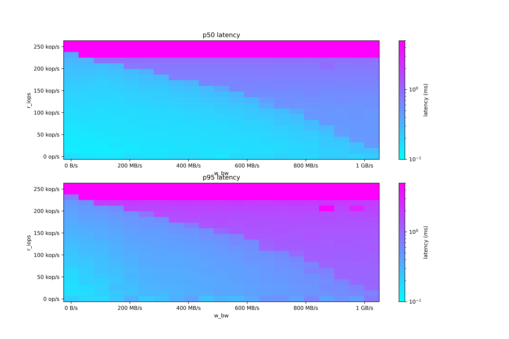
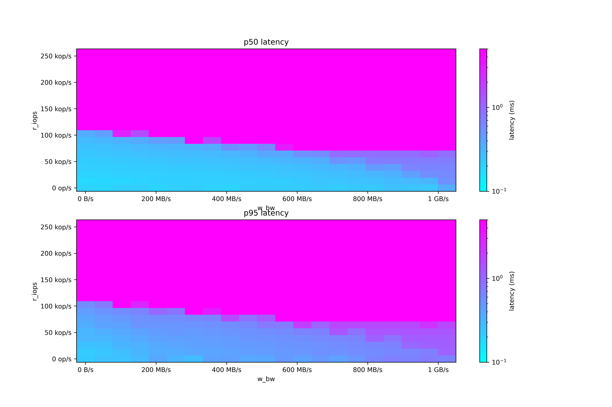
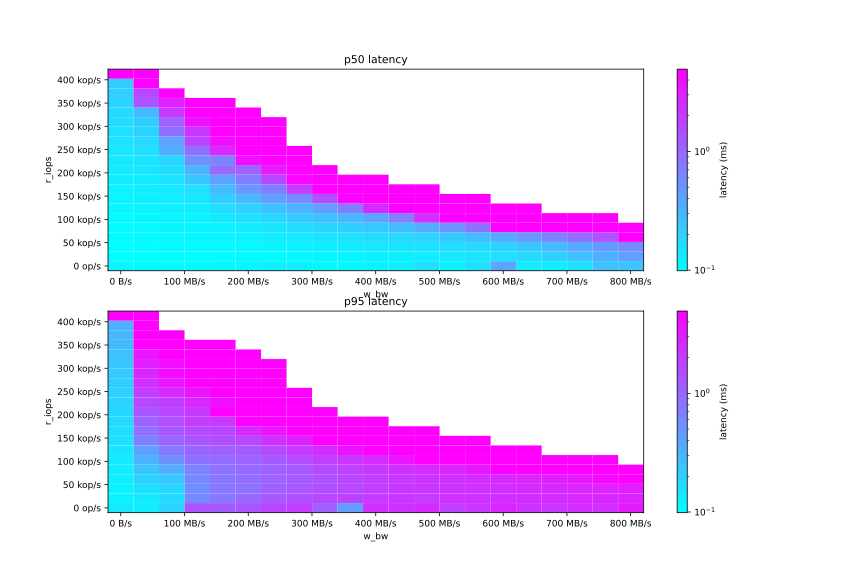
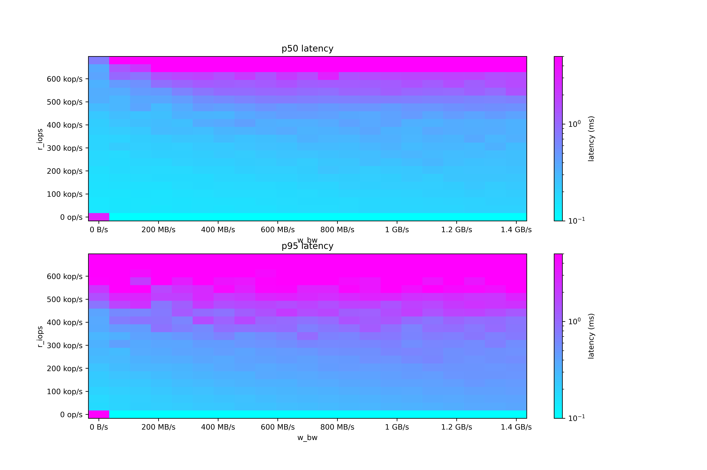
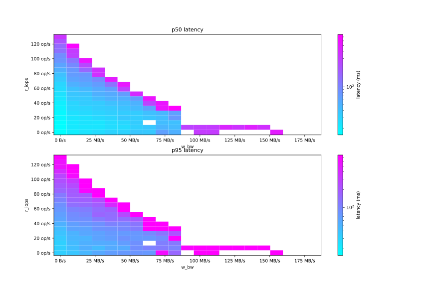

Diskplorer - disk latency/bandwidth grapher
===========================================

Diskplorer is a small set of tools around <code>[fio](https://github.com/axboe/fio)</code> that can be used to discover disk read latency at different read and write workloads. Diskplorer runs a matrix of 21 write workloads (0% to 100% of the maximum bandwidth, in 5% increments) and 21 read workloads (0% to 100% of the maximum IOPS, in 5% increments) for a total of 441 different workloads. The disk is fully written first in order to eliminate clean-disk effects.

Diskplorer runs in two steps: step 1 generates a json result file, and must be run on the system being tested, and step 2 generates latency charts from the result file.


# Running the test

Caution: the test is destructive. Do not use on disks that have real data.

Install the dependencies with

    sudo dnf install -y fio

or

    apt-get install -y fio

Obtain the maximum write bandwith and maximum read IOPS from the device data sheet.

Run diskplorer (substitute N1, N2, and /dev/name with your device parameters):

```console
sudo ./diskplorer.py --max-read-iops N1 --max-write-iops N2 /dev/name --result-file your-results.json
```

It is recommended to save the fio test file for later reference (`--fio-job-directory`)

`sudo` is required due to direct disk access.

This will run for several hours. Some smoke may be emitted from the disk.

# Viewing the results

Once done, copy the result file (`test.json`) to your workstation and view the charts with

    ./latency-postprocess.py test.json


# Sample results

## i3en.3xlarge


With 4k blocksize, showing reduction in IOPS due to increased bandwidth demand:



With 16k blocksize, showing further reduction in IOPS due to increased bandwidth demand:




## i3.2xlarge



## im4gn.4xlarge


## AWS EC2 r5b.2xlarge, EBS GP3 (1000 GB, 1000 MB/s, 16000 IOPS)


## GCP n2-standard-16, 8 local SSDs in RAID 0

These results are using aio instead of io_uring due to [bad interaction between md and io_uring](https://lore.kernel.org/linux-raid/ee22cbab-950f-cdb0-7ef0-5ea0fe67c628@kernel.dk/).



## Toshiba DT01ACA200 hard disk drive

Results for a rotating hard disk drive. Note the throughput and IOPS were
allows to miss by a 15% margin rather than the normal 3% margin.



# Obsolete diskplorer variant

Please see the [old README page](OLD.md)

